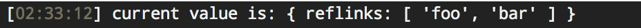

## Usage

```js
var pkg = require('');
var Base = require('base');
var app = new Base();

app.use(pkg());

console.log(app.pkg.data);
//=> {"name": "my-project", ...}
```

## API

Visit [pkg-store][] for additional API details and documentation.

```js
var pkg = require('');
var Base = require('base');
var app = new Base();
```

### .pkg.set

```js
app.pkg.set(key, value);
```

Set property `key` with the given `value`.

**Example**

```js
// given {"name": "my-project"}
app.pkg.set('bin.foo', 'bar');

console.log(app.pkg.data);
//=> {"name": "my-project", "bin": {"foo": "bar"}}
```

### .pkg.save

Persist package.json to the file system at `app.pkg.path`.

```js
app.pkg.save();
```

### .pkg.get

```js
app.pkg.get(key);
```

Get property `key` from package.json.

**Example**

```js
// given {"name": "my-project"}
app.pkg.set('bin.foo', 'bar');

console.log(app.pkg.get('bin'));
//=> {"foo": "bar"}
```

### .pkg.has

```js
app.pkg.has(key);
```

Returns `true` if `package.json` has property `key`.

**Example**

```js
// given: {"name": "my-project"}
console.log(app.pkg.has('name'));
//=> true
console.log(app.pkg.has('zzzzzzz'));
//=> false
```

### .pkg.union

```js
app.pkg.union(key, val);
```

Create array `key`, or concatenate values to array `key`. Also uniquifies the array.

**Example**

```js
app.pkg.union('keywords', 'foo');
app.pkg.union('keywords', ['bar', 'baz']);

console.log(app.pkg.get('keywords'));
//=> ['foo', 'bar', 'baz']
```

## .pkg.expand

Creates a get/set API using [cache-base][], where the cache is populated with a shallow clone of `package.json` with values expanded by [expand-pkg][].

**Example**

```js
console.log(app.pkg.get('author'));
//=> 'Jon Schlinkert (https://github.com/jonschlinkert)'

var expanded = app.pkg.expand();
var author = expanded.get('author');
//=> {name: 'Jon Schlinkert', url: 'https://github.com/jonschlinkert'}
```

## Logging methods

A handful of logging are exposed, as a convenience for implementors to log updates to package.json with visual consistency.

### .pkg.logValue

Log a value.

```js
app.pkg.logValue('current value is:', {reflinks: ['foo', 'bar']});
```

**Example**



### .pkg.logInfo

Log an info message.

```js
app.pkg.logInfo('udpated value:', {reflinks: ['foo', 'bar']});
```

**Example**


### .pkg.logWarning

Log an warning message.

```js
app.pkg.logWarning('deleted value:', {reflinks: ['foo', 'bar']});
```

**Example**


### .pkg.logSuccess

Log a success message.

```js
app.pkg.logSuccess('added value:', {reflinks: ['foo', 'bar']});
```

**Example**


### .pkg.logError

Log an error message.

```js
app.pkg.logError('missing value:', {reflinks: ['foo', 'bar']});
```

**Example**


